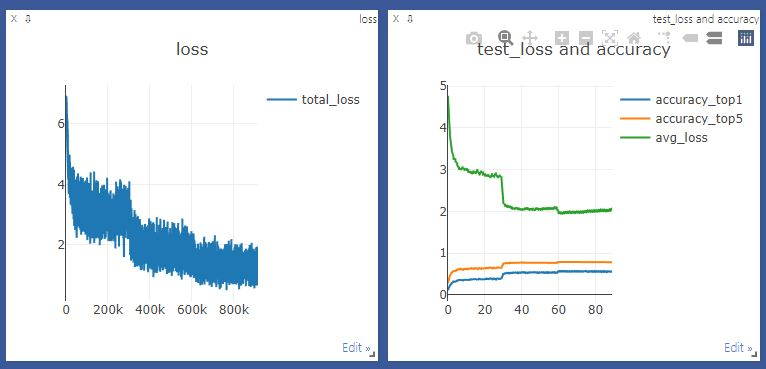

# alexnet pytorch 

:octocat: re-implementation of alexnet  

### comparision with torchvision implementations    

experiments torchvision pretrained params of imagenet classification in ubuntu

### Environments

- Python > 3.5
- pytorch 
- torchvision 

### requirements

- onnx (pip install)
- thop (pip install)

### Experiment via torchvision pretrained params at validation set

test_torchvision.py 

MFLOPS - 10^6

GFLOPS - 10^9

TFLOPS - 10^12

https://pytorch.org/vision/stable/models.html

### Experiment via our training params at validation set

Imagenet

|model                 | # parameters      | Flops              | Resolution | top-1 Acc | top-5 Acc | top-1 Err | top-5 Err | epoch |
|----------------------|-------------------| ------------------ | ---------- | --------- |-----------|-----------| ----------|-------| 
|alexnet (paper)       | -                 | -                  | 224 x 224  | 61.9      | 83.6      | 38.1      | 16.4      |  -    |
|alexnet (torchvision) | 61100840          | 714691904          | 224 x 224  | 56.516    | 79.070    | 43.484    | 20.93     |  _    |
|alexnet (this-repo-ubuntu)   | 61100840          | 714691904          | 224 x 224  | 56.064    | 78.776    | 43.936    | 21.224    |  62   |
|alexnet (this-repo-window)   | 61100840          | 714691904          | 224 x 224  | 56.066    | 78.770    | 43.934    | 21.230    |  62   |

### training options

- batch : 128
- scheduler : step LR
- loss : cross-entropy
- dataset : imagenet ~(138M)
- epoch : 90
- gpu : nvidia geforce rtx 3090 x 4EA
- lr : 1e-2

### training

- dataset

    train : Imagenet training dataset
    test : Imagenet validation dataset

- data augmentation

    for training

    1. RandomResizedCrop()
    2. RandomHorizontalFlip()
    3. PCANoisePIL()
    4. ToTensor()
    5. normalize(mean=[0.485, 0.456, 0.406], std=[0.229, 0.224, 0.225])
    
    for testing
    
    1. Resize()
    2. CenterCrop()
    3. ToTensor()
    4. normalize(mean=[0.485, 0.456, 0.406], std=[0.229, 0.224, 0.225])
    
### Reference

Alexnet : https://papers.nips.cc/paper/2012/file/c399862d3b9d6b76c8436e924a68c45b-Paper.pdf

### Training plots

- it seems that there is a ovefitting while training. 



### Start Guide for Train / Test / Demo

- for training

1. set your env and run main.py

```
# python main.py 
usage: main.py [-h] [--lr] [--batch_size] [--rank] [--epoch] [--vis_step]
               [--num_workers] [--gpu_ids] [--world_size] [--port ] [--rort ] [--start_epoch]
               [--weight_decay] [--momentum] [--save_file_name] [--save_path]
               

  -h, --help            show this help message and exit
  --lr                  initial learning rate (default 1e-2) 
  --batch_size          for training batch size, test batch is only 128.
  --rank                process ID for multi gpu
  --epoch               whole traning epochs   (default 90)
  --vis_step            the step for visualization for visdom 
  --num_workers         dataset num_workers (default 16) for 4 devices
  --gpu_ids             list of gpu numbers  # usage : --gpu_ids 0, 1, 2, 3
  --world_size          the number of all available gpu device 
  --port                visdom port 
  --root                imagenet dataset root
  --start_epoch         when you resume, set the start epochs. 
  --weight_decay        weight_decay for SGD
  --momentum            momentum for SGD
  --save_file_name      when you do experiment, you can change save_file_name to distinguish other pths.
  --save_path           the path to save .pth file

```

- for testing

1. download pre-trained .pth.tar file at [Link](https://livecauac-my.sharepoint.com/:u:/g/personal/csm8167_cau_ac_kr/EYwVCePy2qNFkTTYspUwRVQBixrIozXcjt22SiVHg_I3iw?e=Q9uioS)
2. set ./saves/alexnet.62.pth.tar and root
3. run test.py

```
# python test.py 
usage: test.py [-h] [--root] [--epoch] [--rank] [--gpu_ids] [--save_file_name] [--save_path]
  -h, --help            show this help message and exit
  --root                path for imagenet dataset
  --rank                process ID for multi gpu
  --epoch               test target epoch   (default 62)
  --gpu_ids             list of gpu numbers  # usage : --gpu_ids 0, 1, 2, 3
  --save_file_name      when you do experiment, you can change save_file_name to distinguish other pths.
  --save_path           the path to save .pth file

```

```
...

step : 500 / 500.0
top-1 percentage :  56.066%
top-5 percentage :  78.770%
--------------------------------------------------------------
top-1 error    :  43.934%
top-5 error    :  21.230%
```
